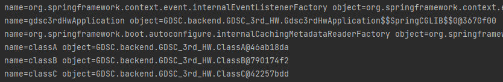
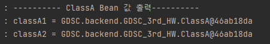

# Spring & Spring Bean
## Spring
### POJO
POJO = Plain Old Java Object   
다음 3가지를 충족하는 경우 POJO 라고 하며, 이는 POJO의 특징이기도 하다.

1. 특정 규약에 종속되지 않는다.
2. 특정 환경에 종속되지 않는다.
3. 객체지향적인 자바 언어의 기본에 충실하게 만들어져야 한다.

즉, 객체지향에 충실하면서 환경과 기술에 대해 독립적인 오브젝트를 POJO 라고 한다.

### Spring
스프링은 POJO 프로그래밍을 위한 기술적 기반이 제공되는 프레임워크이다.   
스프링은 POJO 프로그래밍을 위해 아래와 같은 기술을 지원한다.   
1. IoC/DI
2. AOP
3. PSA

    #### IoC
    Inversion of Control   
    제어와 역전을 의미한다.   
    이때 제어는 객체의 라이프사이클과 메서드 호출을 직접 제어하는 것을 의미한다.   
    즉, 특정 클래스 내에서 객체를 직접 생성한다.   

    역전은 제어를 클래스 내부가 아니라 외부에서 하는 것이다. 대표적인 방법으로 생성자를 통해 객체를 입력받는 것이 있다.

    이를 통해 클래스 간 결합을 느슨히 하여 객체지향 원칙을 잘 지킬 수 있다. (역할과 관심의 분리)   

### Dependency (의존성)
위에서 설명한 '역전' 의 대표적인 방법으로 생성자를 통해 객체를 받아 관리하는 방법이 있는데, 이렇게 생성자를 통해 객체를 받아야만 객체를 생성할 수 있는 경우, 의존성이 있다고 한다.   

```java
public class A {
    private B b;
    public A(B b) {
        this.b = b;
    }
}

public class B {

}

```
위 상황에서 클래스 A의 객체를 생성할 때 클래스 B의 객체를 필요로 하므로, 클래스 A가 클래스 B에 의존하고 있다. 즉, A 클래스는 B 클래스에 대한 의존성을 가진다고 한다.   

### Spring Bean
그렇다면 스프링 빈이란 무엇일까?   
스프링은 IoC 컨테이너를 가지는데, 이 컨테이너가 직접 관리하는 객체가 일부 있다.   
이 객체들을 Spring Bean 이라고 한다.

IoC 컨테이너는 빈을 관리하며 ApplicationContext 라는 인터페이스가 컨테이너를 대표한다.

- 빈 스코프   
빈이 생성, 존재, 적용되는 범위는 크게 싱글톤과 프로토타입으로 나뉜다.   
    - 싱글톤: 기본 스코프로서, 스프링 컨테이너의 시작과 종료까지 유지되는 가장 넓은 스코프   
    - 프로토타입: 컨테이너에 의해 빈의 생성과 의존관계 주입까지만 관리받는 좁은 범위의 스코프

이 외에도 웹 관련 스코프도 있다.
빈의 스코프는 ```@Scope``` 어노테이션으로 지정할 수 있다.

주로 사용되는 것은 싱글톤인데, 싱글톤은 클래스의 인스턴스가 어플리케이션이 실행될 때 단 하나만 생성되어, 해당 클래스와 관련된 동작은 모두 해당 인스턴스에 대해서만 적용되는 디자인  패턴을 말한다.   
이를 통해 이미 만들어진 하나의 객체를 공유하는 효과가 있다.   

싱글톤에는 다형성을 이용하지 못하고, 객체가 공유되기 때문에 단위 테스트가 어렵거나 객체 내부 프로퍼티의 초기화와 변경이 어렵다는 단점이 있지만, 스프링에서는 IoC 컨테이너를 통해 이 문제를 해결하였다.

### 스프링 빈 등록 방법
1. Configuration 파일을 사용한다.   
```@Configuration``` 어노테이션과 ```@Bean``` 어노테이션을 활용해 빈을 등록할 수 있다.

2. 컴포넌트 스캔을 이용해 등록한다.   
메인에서 ```@ComponentScan``` 어노테이션을 이용해 컴포넌트를 스캔하고, 빈으로 등록할 클래스에 ```@Component``` 어노테이션을 주면 빈으로 등록된다.

### 과제 이미지 캡처본


