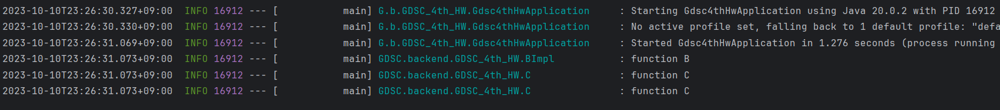

# DI (Dependency Injection, 의존성 주입)

외부에서 두 객체간의 관계를 결정해주는 디자인 패턴.
인터페이스를 사이에 두어 클래스 레벨에서는 의존관계가 고정되지 않도록 한다.  
즉, 코드 레벨에서 상속과 같은 방법으로 클래스간 관계를 고정하지 않고, 인터페이스를 사용하여 해당 인터페이스의 구현체를 활용하여 런타임 단계에서 동적으로 연결관계를 설정한다.

DI를 구현하는 방법은 아래와 같이 4가지가 있다.

1. 생성자 주입
2. setter 주입
3. 필드 주입
4. 일반 메서드 주입

## @Autowired

Autowired 라는 어노테이션을 이용해 DI를 구현하면, 코드에서 직접 객체 생성을 구현하여 주입하지 않고, 스프링 컨테이너에서 생성한 스프링 빈 객체를 스프링이 직접 알아서 주입해준다.  
Autowired 를 사용함으로서 Autowired 가 여러번 사용되더라도, 서로 다른 객체를 여러번 생성하는 것이 아니라, 스프링 컨테이너에 싱글톤으로 생성된 유일 객체 하나가 여러번 사용된 곳에 모두 들어가므로 일관성을 유지할 수 있다.

## 생성자 주입

객체의 생성 시점에 스프링이 해당 객체를 생성하기 위해 필요한 객체를 생성하여 넣어준다.  
생성자가 하나일 경우에는 Autowired 어노테이션이 없어도 자동으로 넣어준다.

## setter 주입

Setter 메소드를 통해 의존성을 주입한다.  
Setter 메소드에 @Autowired 를 붙이면 스프링이 컨테이너에서 생성한 객체를 자동으로 넣어준다.

## 필드 주입

말 그대로 클래스의 필드에 직접 @Autowired 를 이용해 주입하는 방식이다.  
스프링에서 경고를 띄워주는, 더 이상 추천하지 않는 방식으로, 함수를 사용하지 않기 때문에 의존성 주입 과정에 우리가 관여할 수 없어 스프링 프레임워크에 강하게 종속되게 된다.

## 일반 메서드 주입

일종의 초기화 메서드를 사용하여 주입하는 방식으로, 한번에 여러 필드를 주입할 수 있다.  
그런데 생성자 주입과 차별성이 없는데 굳이..?

# DI 주의점

1. 스프링 빈을 이용하지 않고 직접 생성하여 주입하는 경우 NullPointerException 에 주의해야 한다.  
   하지만 생성자 주입을 이용하는 경우, 사용자가 직접 명시적으로 Null 을 넣지 않는 이상 발생하지 않는다.

2. 필드 주입이나, setter 주입을 통해 주입하면 A, B 객체가 서로가 서로를 의존할 때 순환참조 문제가 발생할 수 있다. 이 경우 스프링 프레임워크에서 문제를 알려준다.

# DI 주입대상의 선택 기준

1. 타입
2. @Qualifer
3. @Primary
4. 이름

피자 객체를 생성하기 위해 치즈 객체가 필요하다고 해보자.  
(이때, 치즈는 인터페이스이다.)
만약 스프링 빈에 등록된 치즈의 구현체로 체다치즈와 모짜렐라치즈가 있다면 어떤 구현체를 주입해야 하는지 선택해야 하는 상황이 발생한다.

이때는 스프링에서 주입할 매개변수의 이름과의 유사성을 고려하여 구현체 클래스를 선택해 주입하게 된다.

## @Qualifier

의존성 주입 가능 대상이 여러개일 때, 어떤 구현체를 주입할 지 그 대상을 명시하는 어노테이션이다.

## @Primary

의존성 주입 가능 대상이 여러개일 때, 어떤 구현체를 우선적으로 주입할 지, 우선순위를 정하는 어노테이션이다.

# Lombok

생성자 주입을 자동으로 설정해주는 여러 어노테이션을 제공하여, 반복되는 코드를 줄여주는 자바 라이브러리다.  
클래스와 필드를 설정하고, 별도 생성자 생성없이 어노테이션을 붙여주기만 하면 알아서 어노테이션 종류에 따라 의존성 주입에 필요한 생성자를 자동으로 만들어준다.

# Spring boot

Spring 사용을 위한 개발 설정을 간단하게 도와주는 툴이자, WAS 역할, 라이브러리 관리와 스프링 빈의 자동 등록 등을 도와준다.

## 과제 이미지

