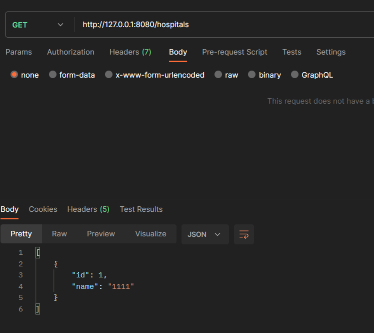
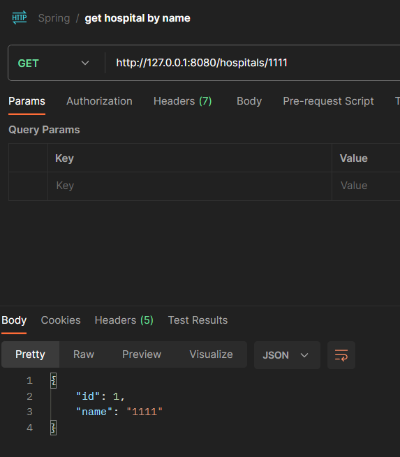

Repository 를 interface로 만들었는데, 실제 DB와 통신하는 기능이 작동해서 신기했습니다..  
사실 노션 내용을 이해를 못했는데, 중간에 메소드 이름만 보고 알아서 기능 구현을 해준다는 부분으로 그렇게 했나보다 이해만 했습니다..ㅎ

---

이후 과제 내용인 환자와 의사 객체를 생성하고 예약 객체를 만들어 조회하는 기능은 스프링 JPA를 제대로 이해하지 못해서 구현하지 못했습니다...
